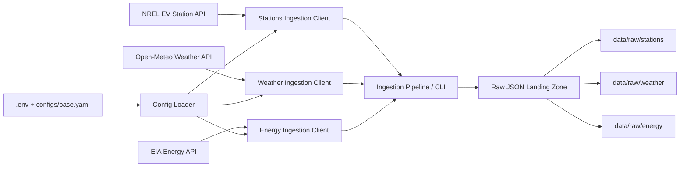

# ChargeFlow

ChargeFlow is an AI-assisted, end-to-end EV charging reliability and analytics platform built with Python and SQL. It combines real public charging-station data, weather and energy context, and realistic synthetic telemetry to support data engineering, analytics, machine learning, and applied AI use cases.

## Business Problem

EV charging networks suffer from fragmented infrastructure data, uneven utilization, equipment downtime, and limited operational visibility. ChargeFlow consolidates public charging-station data with weather and electricity context, then extends it with synthetic operating data to support forecasting, failure-risk modeling, recommendations, and operations workflows.

## Day 1 Scope

Day 1 establishes the project foundation:

- repository structure
- centralized configuration
- environment setup
- public API ingestion clients
- local raw data landing zone
- runnable command-line ingestion flow

## Current Architecture

- `src/ingestion/`: public data clients and command-line ingestion entry points
- `src/utils/`: configuration, logging, filesystem, and HTTP helpers
- `configs/`: project and source configuration
- `data/raw/`: raw landed API payloads
- `docs/`: architecture and project notes

## Day 1 Ingestion Flow



This flow shows how ChargeFlow pulls real public data through source-specific ingestion clients, applies centralized configuration, and stores timestamped raw JSON files for downstream transformation and analytics.

## Data Sources

- NREL Alternative Fuel Stations API for EV charging-station metadata
- Open-Meteo API for free weather context
- U.S. EIA API for electricity grid context

## Stack

Python, SQL, PostgreSQL, Parquet, FastAPI, Streamlit, Power BI, scikit-learn, XGBoost or LightGBM, Chroma or pgvector, optional Groq API

## Setup

```bash
python3 -m venv .venv
source .venv/bin/activate
pip install -e ".[dev]"
cp .env.example .env
```

## Run Day 1 Ingestion

Pull all configured sources:

```bash
chargeflow-ingest pull-all
```

Pull a single source:

```bash
chargeflow-ingest stations
chargeflow-ingest weather
chargeflow-ingest energy
```

If you prefer to avoid package installation for the CLI entry point, you can also run:

```bash
python3 -m src.ingestion.cli pull-all
```

If you added real API keys in `.env`, the ingestion commands will automatically use those values for NREL and EIA.

Raw outputs are written into timestamped files under `data/raw/`.

## AI-Assisted Development Note

This project was AI-assisted. I defined the problem, architecture, constraints, and review standards, and used AI tools to accelerate implementation while remaining responsible for validation, debugging, and final quality.

## Roadmap

- Day 2: synthetic charging sessions, telemetry, failure events, and maintenance logs
- Day 3: warehouse modeling, SQL transformations, and data quality checks
- Day 4: forecasting and failure-risk modeling
- Day 5: recommendation and RAG services
- Day 6: Streamlit app, Power BI outputs, and final polish
