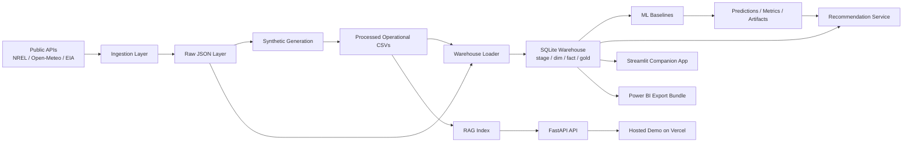

# ChargeFlow

ChargeFlow is an AI-assisted EV charging reliability, demand forecasting, recommendation, and RAG operations platform built with Python and SQL. It combines real public EV infrastructure data, weather and grid context, synthetic operational data, warehouse modeling, ML baselines, recommendation scoring, retrieval over maintenance knowledge, a hosted API demo, and a local Streamlit companion app.

## Why This Project Exists

EV charging operators deal with fragmented infrastructure data, uneven utilization, downtime, queue pressure, and poor operational visibility. ChargeFlow was built to demonstrate end-to-end ownership across the workflow:

- ingest real public data
- generate realistic operational behavior where public data is missing
- model the data into clean warehouse layers
- train baseline forecasting and failure-risk models
- expose recommendation and retrieval services
- present the results through a hosted demo, local app, and Power BI-ready outputs

## What ChargeFlow Does

- Ingests EV station metadata, weather context, and electricity context
- Generates synthetic sessions, telemetry, queues, failures, maintenance tickets, and notes
- Builds raw, processed, warehouse, and gold analytical layers
- Forecasts charging demand and predicts station failure risk
- Recommends stations using reliability, queue, and ML signals
- Retrieves grounded answers from maintenance notes, tickets, and SOPs
- Serves a hosted Vercel demo and a local Streamlit operations console

## Architecture



More detail: `docs/architecture.md`

## Stack

- Python
- SQL
- SQLite for the local analytical warehouse
- FastAPI for services
- Streamlit for the local companion app
- scikit-learn for ML baselines
- TF-IDF retrieval over maintenance and SOP content
- Vercel for the hosted portfolio demo
- Power BI-ready CSV exports

## Repository Layout

```text
chargeflow/
  app/              # local Streamlit companion app
  api/              # FastAPI service entrypoints
  configs/          # YAML configuration
  data/             # raw, processed, gold outputs
  demo_assets/      # checked-in hosted-demo assets
  docs/             # architecture, runbooks, deployment guides
  scripts/          # utility and export scripts
  sql/              # warehouse DDL and transformation SQL
  src/              # ingestion, synthetic, warehouse, ml, recommender, rag
  tests/            # verification
  README.md
```

## Setup

```bash
python3 -m venv .venv
source .venv/bin/activate
pip install -r requirements.txt
cp .env.example .env
```

Optional environment variables:

- `NREL_API_KEY`
- `EIA_API_KEY`
- `GROQ_API_KEY`

## Local End-to-End Run

Day-by-day runnable path:

```bash
python3 -m src.ingestion.cli pull-all
python3 -m src.synthetic.cli generate-all
python3 -m src.warehouse.cli build-all
python3 -m src.ml.cli run-all
python3 -m src.rag.cli build-index
python3 scripts/export_powerbi.py
```

## Local App and API

Run the local API:

```bash
python3 -m uvicorn api.main:app --reload
```

Run the local Streamlit companion app:

```bash
python3 -m streamlit run app/streamlit_app.py
```

## Hosted Demo

ChargeFlow uses a split delivery model:

- Hosted portfolio demo on Vercel:
  - static frontend from `public/index.html`
  - FastAPI backend from `api/index.py`
  - checked-in hosted demo data under `demo_assets/`
- Local companion app:
  - Streamlit for fuller local exploration

Deployment guide: `docs/vercel_deploy.md`

## Power BI Outputs

Create the Power BI-ready export bundle:

```bash
python3 scripts/export_powerbi.py
```

Guide: `docs/power_bi.md`

## Key Outputs

- Raw source data: `data/raw/`
- Synthetic operational data: `data/processed/synthetic/`
- Warehouse and marts: `data/processed/warehouse/`
- ML artifacts and predictions: `data/processed/ml/`
- Recommendation and retrieval assets: `data/processed/recommender/`, `data/processed/rag/`
- Power BI bundle: `data/gold/power_bi_exports/`

## Documentation

- Architecture: `docs/architecture.md`
- Day 1 foundation: `docs/day1_foundation.md`
- Day 2 synthetic generation: `docs/day2_synthetic_generation.md`
- Day 3 warehouse: `docs/day3_warehouse.md`
- Day 4 ML: `docs/day4_ml.md`
- Day 5 services: `docs/day5_services.md`
- Vercel deployment: `docs/vercel_deploy.md`
- Power BI guide: `docs/power_bi.md`
- Demo runbook: `docs/demo_runbook.md`

## Demo Screenshots

Screenshot placeholders for the final portfolio version:

- Hosted Vercel landing page
- Local Streamlit operations console
- Recommendation results view
- Grounded ops assistant view
- Power BI dashboard view

## AI-Assisted Development Note

This project was AI-assisted. I defined the problem, architecture, constraints, and review standards, and used AI tools to accelerate implementation while remaining responsible for validation, debugging, and final quality.

## License / Copyright
© 2026 Yash Chetan Doshi. All rights reserved.

You may not copy, modify, distribute, or use any part of this repository or its contents without prior written permission from the author.
