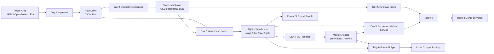

# ChargeFlow Architecture

## Explanation

- Day 1 ingests public EV, weather, and energy data into a raw landing zone.
- Day 2 generates synthetic operational data anchored to the real station layer.
- Day 3 loads raw and synthetic data into a local SQL warehouse and produces gold marts.
- Day 4 trains baseline models and saves prediction artifacts.
- Day 5 adds recommendation scoring and retrieval over maintenance knowledge, exposed via FastAPI.
- Day 6 surfaces the system through a local Streamlit companion app, a hosted Vercel demo, and Power BI-ready exports.
