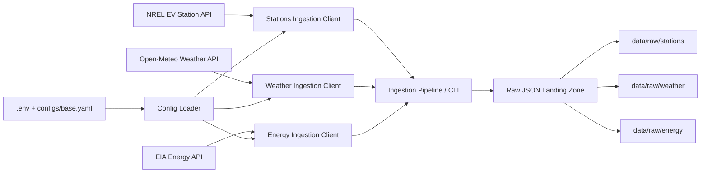

# Day 1 Foundation Notes

## Scope

Day 1 creates a clean ingestion foundation for ChargeFlow using free public data and local raw storage.

## Design Choices

- Public source payloads are landed as raw JSON first to preserve lineage.
- Configuration is centralized in `configs/base.yaml` and environment variables.
- API-key-based sources use `DEMO_KEY` by default so local setup works without paid access.
- Weather ingestion uses configured metro coordinates on Day 1 and can later be refined to station-level enrichment.
- The command-line interface keeps ingestion steps explicit and easy to explain in interviews.

## Ingestion Diagram

## How To Explain It

- The external APIs provide the three real Day 1 source layers: station metadata, weather context, and energy context.
- `.env` holds environment-specific values such as API keys, while `configs/base.yaml` holds reusable defaults like states, regions, limits, and source URLs.
- Each ingestion client handles one source only, which keeps responsibilities clean and makes the code easier to maintain and test.
- The CLI triggers either a single-source pull or the combined `pull-all` pipeline.
- The pipeline writes timestamped raw JSON files into `data/raw/` so later warehouse transformations can preserve lineage back to the original source payloads.

## Day 1 Assumptions

- The project should remain fully usable on a local machine.
- Free public APIs are preferable even when they have modest rate limits.
- Downstream cleaned and gold layers will be built after raw ingestion is stable.
